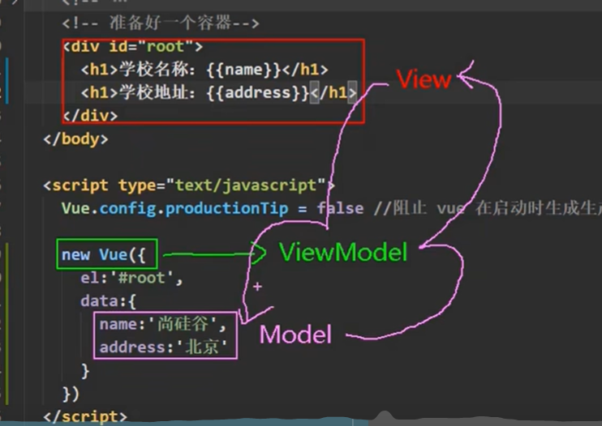
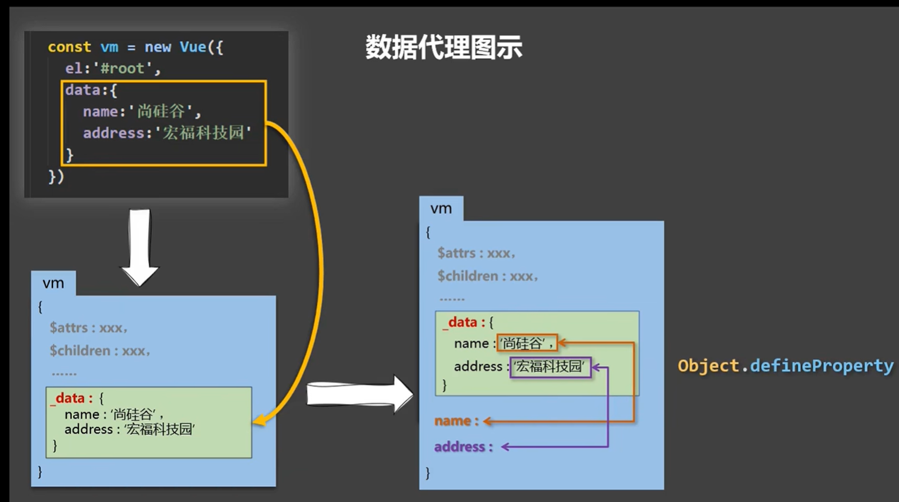

## 基础语法

### 1、Vue容器

指定当前Vue实例为哪个容器，值通常为css选择器；容器和实例是一对一关系

1. el的两种写法：

    - new Vue时，传入el的参数： `new Vue({el: '容器'})`
    - 获取Vue的实例化对象，使用$mount挂载dom, `vue.$mount('容器')`

### 2、 语法

1. 插值语法：{{}} 里面写js表达式
2. 指令语法: 给标签中的任何属性和值绑定值；v-bind:  ===简写===> :

### 3、 vue中有两种数据绑定方式

1. 数据绑定
   
    - 单向绑定（v-bind）：数据只能从data流向页面
    - 双向绑定（v-model）：数据不仅能从data流向页面，还可以从页面流向data
    - 备注：
        1. 双向绑定一般应用在表单元素上
        2. v-model:value可以简写为v-model

2. data的两种写法
    - 对象式：`data: {name: '张三'}`
    - 函数式：`data(){return {name: '张三'}}`  函数中的this指向Vue实例，不能写成箭头函数，箭头函数this指向全局对象

### 4、MVVM模型
- M：模型（Model）：data中的数据
- V：视图（View）：模板代码
- VM：视图模型（ViewModel）：Vue实例对象

    
    

### 5、数据代理：通过一个对象代理对另一个对象中属性的操作（读/写）

Objecect.defineProperty()方法：Vue2中实现数据代理的核心方法。作用：给对象添加属性，或修改对象的属性值

- enumerable: false   是否可枚举，默认为false，不可枚举，即不可通过for...in循环遍历，不可通过Object.keys()获取属性名，不可通过JSON.stringify()序列化对象
- configurable: false  是否可删除，默认为false，不可删除，即不可通过delete删除属性
- writable: false 是否可可修改，默认为false，不可修改，即不可通过赋值操作修改属性值

    ```javascript
    // 通过obj1.x来操作obj.x, obj.x的值变化之后，obj1.x会自动变化，反之亦然
    const obj = { x: 100 }
    const obj1 = { y: 200 }

    Object.defineProperty(obj1, 'x', {
        get() {
            return obj.x
        }, 
        set(value) {
            obj.x = value
        }
    })
    ```
    

### 6、事件处理

#### 1、事件绑定

1. 使用v-on:xxx 或 @xxx 绑定事件，其中xxx是事件名
2. 事件的回调需要配置在methods对象中，最终会在vm上；
3. methods中配置的函数，，不要用箭头函数，否则this指向的是window，不是Vue实例
4. methods中配置的函数，都是被被Vue所管理的函数，this指向Vue实例，所以可以访问data中的属性
5. @click="demo" 和 @click="demo($event)" 效果一样，但后者可以传参，$event代表原生事件对象

#### 2、事件修饰符

可以连续写

1. preventent：阻止默认事件（常用）
2. stop：阻止事件冒泡（常用）（冒泡：由内到外，子元素到父元素）（冒泡时，触发父元素的事件，但是target还是指向子元素）
3. once：事件只触发一次（常用）
4. capture：使用事件的捕获模式（由外往内）
5. self：只有event.target是当前操作的元素时才触发事件，冒泡触发时，因为target是指向子元素，所以这个方法不执行，一定程度上上可以阻止冒泡
6. passive：事件的默认行为立即执行，无需等待事件回调执行完毕（比如绑定滚动事件，默认会先执行事件中的代码，在去滚动页面，passive会先关东页面，在执行绑定的方法）

#### 3、键盘事件: 

1. vue中常用的按键别名  `@keyup.enter: 给enter按键绑定事件`

    1. 回车 - enter（13）
    2. 删除 - delete
    3. 退出 - esc
    4. 空格 - space
    5. 换行 - tab （移除焦点，不建议使用keyup, 配合keydown使用）
    6. 上 - up
    7. 下 - down
    8. 左 - left
    9. 右 - right

2. 系统修饰键：ctrl、alt、shift、meta（win键） `@keyup.ctrl.y`

    1. 配合keyup使用：按下修饰键的同时，再按下其他键，随后释放
    2. 配合keydown使用，正常触发事件
    3. vue未提供别名的按键，可以使用按键原始的的key值去绑定，但要注意转为kebab-case（短横线命名）
    4. Vue.config.keyCodes.自定义键名 = 键码， 可以去定制按键别名

### 7、计算属性 computed和监视属性 watch

#### 1、计算属性

1. 初次读取或依赖的数据发生改变，会被调用
2. 与methods实现相比，内部有缓存机制，效率更高，调试方便
3. 备注：计算`属性`最终会出现在Vue实例上，直接读取使用即可

#### 2、监视属性

1. 当被监视的属性变化时，回调函数自动调用
2. 监视的属性必须存在，才能进行监视！！
3. 监视属性的两种写法：
    - new Vue时传入watch配置
    - 通过vm.$watch监视

#### 3、深度监视

1. Vue中watch默认不监视对象内部值的改变（一层监视）
2. 配置deep: true 可以进行深度监视（多层）
3. 备注：
    - Vue自身可以监视对象内部值的改变，但Vue提供的watch默认不可以！！！
    - 通过watch进行深度监视，可以深度监视对象内部值的变化

#### 4、watch与computed对比

1. compputed能完成的功能，watch都可以完成
2. watch能完成的功能，computed不一定能完成，例如watch可以进行异步操作
3. 两个重要的小原则：
    - 所有被Vue管理的函数，最好写成普通函数，这样this的指向才是vm或组件实例对象
    - 所有不被Vue管理的函数（定时器回调、ajax回调函数等），最好写成箭头函数（箭头函数会从它们的包含上下文中继承 this 值），这样this的指向才是vm或组件实例