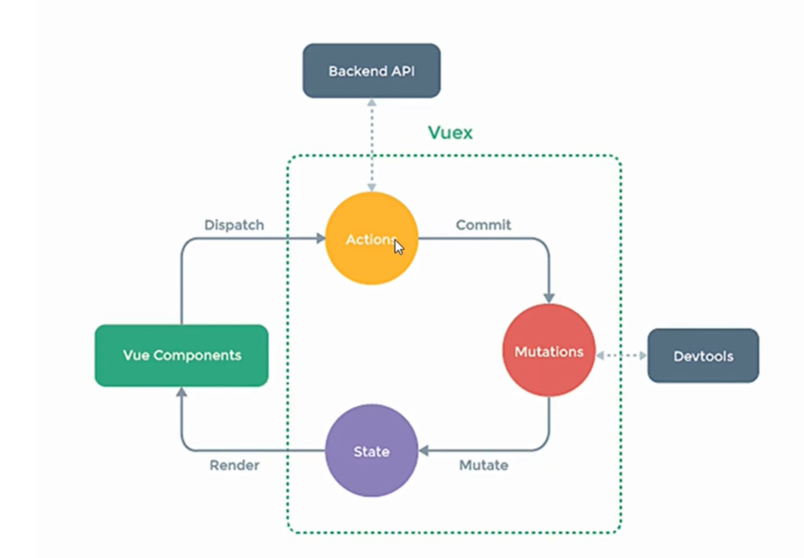

## Vuex

### 1、定义

1. 概念

    在Vue中实现`集中式``状态（数据）`管理的一个Vue`插件`，对vue应用中多个组件的共享状态进行集中式的管理`（读/写）`，也是一种组件间通信的方式，且适用于任意组件间通信。

2. 何时使用

    多个组件需要共享数据时

    1. 多个组件依赖同一个状态

    2. 来自不同组件的行为需要变更同一状态

### 2、工作原理



### 3、搭建vuex环境

1. 创建文件：src/store/index.js

    ```javascript
    //引入Vue核心库
    import Vue from 'vue'
    //引入Vuex
    import Vuex from 'vuex'
    //应用Vuex插件
    Vue.use(Vuex)

    //准备actions对象——响应组件中用户的动作
    const actions = {}
    //准备mutations对象——修改state中的数据
    const mutations = {}
    //准备state对象——保存具体的数据
    const state = {}

    //创建并暴露store
    export default new Vuex.Store({
        actions,
        mutations,
        state
    })
    ```

2. 在main.js中创建vm时传入store配置项

    ```javascript
    ......
    //引入store
    import store from './store'
    ......

    //创建vm
    new Vue({
        el:'#app',
        render: h => h(App),
        store
    })
    ```