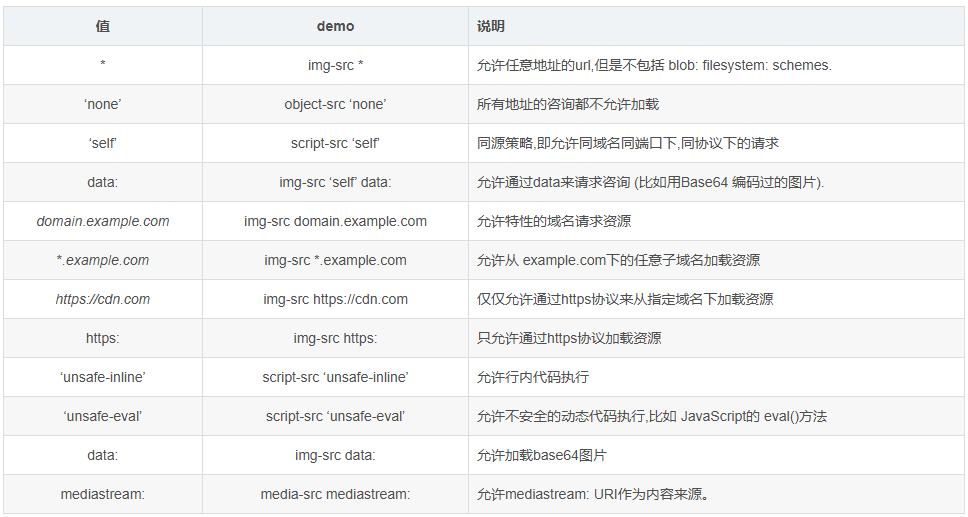

# Electron

## 0. 初始化Electron项目

```powershell
# Clone this repository
git clone https://github.com/electron/electron-quick-start
# Go into the repository
cd electron-quick-start
# Install dependencies
npm install
# Run the app
npm start
```

注意：运行时报错`electron always "Electron failed to install correctly, please delete node_modules/electron and try installing again"`, 解决方法，设置`set ELECTRON_OVERRIDE_DIST_PATH=./node_modules/electron/dist`

## 1. 核心组成部分


1. `chromium`: 支持最新特性的浏览器

2. `node.js`：js运行时，可实现文件读写等

3. `native APIs`: 提供统一的原生界面能力

## 2. 工作流程


1. 主进程

    - 看做是`package.json`中`main`属性对应的文件

        ```json
        {
            "name": "my-electron-app",
            "version": "1.0.0",
            "description": "Hello World!",
            "main": "main.js",
            "author": "Jane Doe",
            "license": "MIT"
        }
        ```

    - 一个应用只有一个主进程

    - 只有主进程可以进行`GUI`的`API`操作

2. 渲染进程

    - `windows`中展示的界面通过渲染基础南横表现

    - 一个应用可以有多个渲染进程

## 3. 生命周期


```js
mainWindow.loadFile('index.html')

mainWindow.webContents.on('did-finish-load', () => {
  console.log('did-finish-load')
})

mainWindow.webContents.on('dom-ready', () => {
  console.log('dom-ready')
})

mainWindow.on('close', () => {
  console.log('The window is closed')
})

app.on('ready', createWindow)

app.on('before-quit', () => {
  console.log('before-quit')
})

app.on('will-quit', () => {
  console.log('will-quit')
})

app.on('window-all-closed', function () {
  console.log('window-all-closed')
})
```

### 4. 主进程和渲染进程

#### 1. 在渲染进程引入electron模块


1. 安装

    `npm install --save @electron/remote`

2. 主进程中引入和初始化

```js
/*
@electron/remote/main 模块的主要作用是：

1. 在主进程中暴露需要被渲染进程访问的变量和函数等对象，通常使用 remote 的 expose 方法来实现。

2. 在渲染进程中使用 remote 模块获取主进程暴露的对象，在其上调用相应的方法或访问属性等。

3. @electron/remote/main 模块会自动将从渲染进程传回的值转换成安全的序列化类型，在主进程中可以安全地进行操作，避免了出现安全问题。
*/ 
const remote = require("@electron/remote/main")

/* 
initialize 是 @electron/remote/main 模块的一个方法，用于初始化远程调用机制

1. 设置远程调用的上下文信息，比如当前进程的 ID 和 WebContents 对象等。

2. 创建远程对象的代理，通过代理对象实现远程调用。

3. 为远程对象的所有方法和属性创建同名的本地方法和属性，以便让开发者在调用时更加自然。

*/
remote.initialize()

remote.enable(mainWindow.webContents)
```

3. 渲染进程中引用

```js
const { BrowserWindow } = require("@electron/remote")
```

### 5. 前端设置Content-Security-Policy

`Content-Security-Policy` 的实质就是白名单制度，开发者明确告诉客户端，**哪些外部资源可以加载和执行**，等同于提供白名单。它的实现和执行全部由浏览器完成，开发者只需提供配置。

```html
<meta http-equiv="Content-Security-Policy"
    content="default-src 'self' https://www.electronjs.org; script-src 'self'; style-src 'self' 'unsafe-inline'; img-src data:">
```

1. 限制方式

- `default-src`: 限制全局,默认所有都会使用这种规则
- `script-src`: 限制JavaScript的源地址。
- `style-src`: 限制层叠样式表文件源。
- `img-src`: 限制图片和图标的源地址
- ...

2. 多个资源时,后面的会覆盖前面的

    