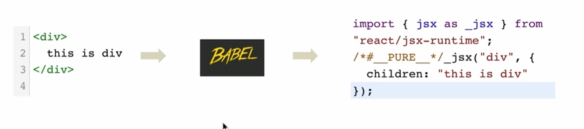

## React

### 1. 简介

#### 1. 定义

React一个将数据渲染为html视图的开源js库。

- 是一个将数据渲染为 HTML 视图的开源 JS 库
- 它遵循基于组件的方法，有助于构建可重用的 UI 组件
- 它用于开发复杂的交互式的 web 和移动 UI

#### 2. 特点

1. 使用虚拟 DOM 而不是真正的 DOM
2. 可以用服务器渲染
3. 遵循单向数据流或数据绑定
4. 高效
5. 声明式编码，组件化编码

#### 3. 优点

1. 它提高了应用的性能
2. 可以方便在客户端和服务器端使用
3. 由于使用 JSX，代码的可读性更好
4. 使用React，编写 UI 测试用例变得非常容易

#### 4. 为什么学

1. 原生JS操作DOM繁琐，效率低
2. 使用JS直接操作DOM,浏览器会进行大量的重绘重排
3. 原生JS没有组件化编码方案，代码复用低

### 2. 虚拟dom和真实dom

#### 1. 虚拟 dom

1. 本质是一个Object对象
2. 比较”轻“，因为虚拟dom是react内部在用，无需真是dom上那么多属性
3. 虚拟dom最终会被react转化为真实dom，呈现在页面上

#### 2. 真实 dom

1. 浏览器中实际存在的DOM树，它直接反映了HTML文档的结构和状态

### 3. JSX

#### 1. 定义

1. JSX是`JavaScript`和`HTML`缩写，表示在JS代码中编写HTML模板结构，它是react中编写UI模板的方式

    ```javascript
    function App() {
        return (
            <div className="App">
                this is App
            </div>
        );
    }
    ```

2. `HTML`的声明方式和`JS`的可编程能力

3. JS的语法扩展，浏览器本身不能识别，需要解析工具解析后才能运行

    

4. 注意点

    - 定义虚拟dom时，不要写引号
    - 标签中混入js表达式时要用{}
    - 样式的类名指定不要用`class`，要用`className`
    - 内敛样式要使用{{}}包裹
    - 不能有多个根标签，只能有一个根标签
    - JSX的标签必须正确结束（自结束标签必须写/）
    - JSX中html标签应该小写，React组件应该大写开头。如果小写字母开头，就将标签转化为 html 同名元素，如果 html 中无该标签对应的元素，就报错；如果是大写字母开头，react 就去渲染对应的组件，如果没有就报错
    - 如果表达式是空值、布尔值、undefined，将不会显示
        > 关于JS表达式和JS语句:
        >
        > JS表达式：返回一个值，可以放在任何一个需要值的地方 a a+b demo(a) arr.map() function text(){}
        >
        > JS语句：if(){} for(){} while(){} swith(){} 不会返回一个值
    - 注释写在花括号里
    - JSX 允许在模板中插入数组，数组自动展开全部成员
        ```javascript
        var arr = [
            <h1>小丞</h1>,
            <h2>同学</h2>,
        ];
        ReactDOM.render(
            <div>{arr}</div>,
            document.getElementById('example')
        );
        ```

#### 2. 在JSX中使用JS表达式

在jsx中可以通过`大括号{}`识别js中的表达式；if语句，switch语句等属于语句，不是表达式，不能在大括号中展示

1. 使用引号传递字符串

2. 使用js变量

3. 函数调用和方法调用

4. 使用js对象

    ```javascript
    export default function Basic() {
        const count = 100;
        return (
            <div>
                {'this is basic component'}
                {getComponentName()}
                {count}
                {new Date().getDate()}
                <div style={{ color: 'red' }}>展示一下对象</div>
            </div>
        );
    }
    ```

#### 3. 列表渲染

`key`: 独一无二的字符串或number

```javascript
<ul>
    {
        list.map(item => {
            return <li key={item.id}>{item.name}</li>
        })
    }
</ul>
```

#### 3. 条件渲染

1. 基础渲染： 逻辑与运算符`&&`，三元表达式 `?:`

2. 高级渲染

    ```javascript
    const articleType = 1; // 0 1 2

    function getArticleItem(articleType) {
        if(articleType === 0) {
            return <div>我是无图模式</div>
        } else if(articleType === 1) {
            return <div>我是单图模式</div>
        } else if(articleType === 2) {
            return <div>我是三图模式</div>
        }
    }
    ```

### 4.组件

当应用是以多组件的方式实现，这个应用就是一个组件化的应用

- 函数组件
- 类式组件

#### 1. 函数式组件

定义组件最简单的方式就是编写 JavaScript 函数：

```js
 //1.创建函数式组件
      function MyComponent(props) {
        console.log(this) //此处的this是undefined，因为babel编译后开启了严格模式
        return <h2>我是用函数定义的组件(适用于【简单组件】的定义)</h2>
      }

 //2.渲染组件到页面
      ReactDOM.render(<MyComponent />, document.getElementById('test'))
```

该函数是一个有效的 React 组件，因为它接收唯一带有数据的 “props”（代表属性）对象与并返回一个 React 元素。这类组件被称为“函数组件”，因为它本质上就是 JavaScript 函数。

#### 2. 类式组件

```js
class MyComponent extends React.Component {
        render() {
          console.log('render中的this:', this)
          return <h2>我是用类定义的组件(适用于【复杂组件】的定义)</h2>
        }
      }

ReactDOM.render(<MyComponent />, document.getElementById('test'))
```

每次组件更新时 `render` 方法都会被调用，但只要在相同的 DOM 节点中渲染 `<MyComponent/>` ，就仅有一个 `MyComponent` 组件的 class 实例被创建使用。这就使得我们可以使用如 state 或生命周期方法等很多其他特性。

**执行过程：**

1. React解析组件标签，找到相应的组件

2. 发现组件是类定义的，随后new出来的类的实例，并通过该实例调用到原型上的render方法

3. 将render返回的虚拟DOM转化为真实的DOM,随后呈现在页面中

### 5. 类组件中三大属性：state, props, refs

#### 1. state

##### 1. 基本使用

````js
class Hello extends React.Component {

    constructor(props) {
        super(props);

        // 初始化state
        this.state = {
            isHot: true
        }

        // 将handlerClick绑定在实例上（点击时，先找实例身上的方法）；bind返回一个新的函数
        this.handlerButtonClick = this.handlerClick.bind(this);
    }

    /*
    * 类中的方法放在原型对象上，供实例使用
    * 由于handlerClick是作为onClick的回调，所以不是通过实例调用的，是直接调用
    * 类中的方法默认开启了局部严格模式，所以handlerClick的this为undefined
    * 解决方法： this.handlerClick = this.handlerClick.bind(this);
    */
    handlerClick() {
        console.log('dianji1', this)

        // 严重注意：state不可直接更改，必须通过setState方法更改
        // this.state.isHot = !this.state.isHot;  （不生效）

        // 严重注意：React 中不建议 `state`不允许直接修改，而是通过类的原型对象上的方法 `setState()`
        this.setState({ isHot: !this.state.isHot })
    }

    /*
    * render是放在哪里的？类的原型对象上，供实例使用
    * render中的this是谁？类的实例对象，通过该实例对象调用render
    */
    render() {
        const { isHot } = this.state;
        return <div>
            <h1>今天天气很{isHot ? '炎热' : '寒冷'}</h1>
            { /* onClick应该调用实例上的方法 */}
            <button onClick={this.handlerButtonClick}>切换天气</button>
        </div>
    }
}
````

**注意：**

1. 组件的构造函数，必须要传递一个props参数

2. 特别关注this【重点】，类中所有的方法局部都开启了严格模式，如果直接进行调用，this就是undefined

3. 想要改变state,需要使用setState进行修改，如果只是修改state的部分属性，则不会影响其他的属性，这个只是合并并不是覆盖。

**在优化过程中遇到的问题**

1. 组件中的 render 方法中的 this 为组件实例对象
2. 组件自定义方法中由于开启了严格模式，this 指向`undefined`如何解决
   1. 通过 bind 改变 this 指向
   2. 推荐采用箭头函数，箭头函数的 `this` 指向
3. state 数据不能直接修改或者更新

##### 2. setState()

this.setState()，该方法接收两种参数：对象或函数。

```js
this.setState(partialState, [callback]);
```

- `partialState`: 需要更新的状态的部分对象
- `callback`: 更新完状态后的回调函数

**有两种写法:**

1. 对象：即想要修改的state

   ```js
   this.setState({
       isHot: false
   })
   ```

2. 函数：接收两个函数，第一个函数接受两个参数，第一个是当前state，第二个是当前props，该函数返回一个对象，和直接传递对象参数是一样的，就是要修改的state；第二个函数参数是state改变后触发的回调

    ```js
    this.setState(state => { count: state.count + 1 });
    ```

- 在执行 `setState`操作后，React 会自动调用一次 `render()`
- `render()` 的执行次数是 1+n (1 为初始化时的自动调用，n 为状态更新的次数)

##### 3. 简化版本

```js
class Demo extends React.Component {
    // 不写在构造器中，直接写在实例上
    state = { isHot: true }

    /*
        * 精简方法：不想再构造器中改变自定义方法的this指向
        * 将方法携程箭头函数，箭头函数的this指向上下文
        */
    handlerClick = () => {
        this.setState({ isHot: !this.state.isHot })
    }

    render() {
        const { isHot } = this.state;
        return <div>
            <h1>今天天气很{isHot ? '炎热' : '寒冷'}</h1>
            <button onClick={this.handlerClick}>切换天气</button>
        </div>
    }
}
```
1. state的赋值可以不再构造函数中进行，直接写在实例上

2. 使用了箭头函数，将this进行了改变

##### 4. State 的更新可能是异步的

**React控制之外的事件中调用setState是同步更新的。比如原生js绑定的事件，setTimeout/setInterval等**。

> 18版本中测试setTimeout回调函数中也是异步更新的

**大部分开发中用到的都是React封装的事件，比如onChange、onClick、onTouchMove等，这些事件处理程序中的setState都是异步处理的。**

```js
//1.创建组件
class St extends React.Component{
    state = {isHot:10};
    render(){
        return <h1 onClick = {this.dem}>点击事件</h1> 
    }

    dem = () =>{
        //修改isHot
        this.setState({ isHot: this.state.isHot + 1})
        console.log(this.state.isHot);
    }
}
```

上面的案例中预期setState使得isHot变成了11，输出也应该是11。然而在控制台打印的却是10，也就是并没有对其进行更新。这是因为异步的进行了处理，在输出的时候还没有对其进行处理。

```js
document.getElementById("test").addEventListener("click",()=>{
        this.setState({isHot: this.state.isHot + 1});
        console.log(this.state.isHot);
})
```

但是通过这个原生JS的，可以发现，控制台打印的就是11，也就是已经对其进行了处理。也就是进行了同步的更新。

**React怎么调用同步或者异步的呢？**

在 React 的 setState 函数实现中，会根据一个变量 isBatchingUpdates 判断是直接更新 this.state 还是放到队列中延时更新，而 isBatchingUpdates 默认是 false，表示 setState 会同步更新 this.state；但是，有一个函数 batchedUpdates，该函数会把 isBatchingUpdates 修改为 true，而当 React 在调用事件处理函数之前就会先调用这个 batchedUpdates将isBatchingUpdates修改为true，这样由 React 控制的事件处理过程 setState 不会同步更新 this.state。

**如果是同步更新，每一个setState对调用一个render，并且如果多次调用setState会以最后调用的为准，前面的将会作废；如果是异步更新，多个setSate会统一调用一次render**

```js
dem = () =>{
    this.setState({
        isHot:  1,
        cont:444
    })
    this.setState({
    	isHot: this.state.isHot + 1
    })
    this.setState({
        isHot:  888,
        cont:888
    })
}
```

上面的最后会输出：isHot是888，cont是888

```js
 dem = ()=> {  
    this.setState({
        isHot: this.state.isHot + 1,

    })
    this.setState({
        isHot: this.state.isHot + 1,

    })
    this.setState({
        isHot: this.state.isHot + 888
    })
}
```

初始isHot为10，最后isHot输出为898，也就是前面两个都没有执行。

**注意！！这是异步更新才有的，如果同步更新，每一次都会调用render，这样每一次更新都会 **

##### 5 异步更新解决方案

出于性能考虑，React 可能会把多个 `setState()` 调用合并成一个调用。

因为 `this.props` 和 `this.state` 可能会异步更新，所以你不要依赖他们的值来更新下一个状态。

例如，此代码可能会无法更新计数器：

```js
// Wrong
this.setState({
  counter: this.state.counter + this.props.increment,
});
```

要解决这个问题，可以让 `setState()` 接收一个函数而不是一个对象。这个函数用上一个 state 作为第一个参数，将此次更新被应用时的 props 做为第二个参数：

```js
// Correct
this.setState((state, props) => ({
  counter: state.counter + props.increment
}));
```

#### 2. props

##### 1. 基本使用

与`state`不同，`state`是组件自身的状态，而`props`则是外部传入的数据

基本使用：

```js
class Person extends React.Component{
    render(){
        const { name, age, sex } = this.props.person;
        return (
            <ul>
                <li>姓名：{name}</li>
                <li>性别：{sex}</li>
                <li>年龄：{age + 1}</li>
            </ul>
        )
    }
}
//传递数据
ReactDOM.render(<Person person={{ name: 'tom', age: 18, sex: '男'}} />,document.getElementById("div"));
```

1. 通过在组件标签上传递值，在组件中就可以获取到所传递的值
2. 在构造器里的`props`参数里可以获取到 `props`
3. 可以分别设置 `propTypes` 和 `defaultProps` 两个属性来分别操作 `props`的规范和默认值，两者都是直接添加在类式组件的**原型对象**上的（所以需要添加 `static`）
4. 同时可以通过`...`运算符来简化
5. props 的只读性

**注意！！** **{...P}并不能展开一个对象**

**props传递一个对象，是因为babel+react使得{..p}可以展开对象，但是只有在标签中才能使用**

##### 2. props限制

React 内置了一些类型检查的功能。要在组件的 props 上进行类型检查，你只需配置特定的 `propTypes` 属性：

react对此提供了相应的解决方法：

- propTypes:类型检查，还可以限制不能为空
- defaultProps：默认值

```js
// 定义成类中的静态属性
//对标签属性进行类型、必要性的限制
static propTypes = {
    name:PropTypes.string.isRequired, //限制name必传，且为字符串
    sex:PropTypes.string,//限制sex为字符串
    age:PropTypes.number,//限制age为数值
    speak:PropTypes.func,//限制speak为函数
}
//指定默认标签属性值
static defaultProps = {
    sex:'男',//sex默认值为男
    age:18 //age默认值为18
}
```

当传入的 `prop` 值类型不正确时，JavaScript 控制台将会显示警告。出于性能方面的考虑，`propTypes` 仅在开发模式下进行检查。

`defaultProps` 用于确保 `this.props.sex` 在父组件没有指定其值时，有一个默认值。`propTypes` 类型检查发生在 `defaultProps` 赋值后，所以类型检查也适用于 `defaultProps`。

#### 3. refs

**何时使用 Refs**

下面是几个适合使用 refs 的情况：

- 管理焦点，文本选择或媒体播放。
- 触发强制动画。
- 集成第三方 DOM 库。

避免使用 refs 来做任何可以通过声明式实现来完成的事情。

**有三种操作`refs`的方法，分别为：**

- 字符串形式
- 回调形式
- `createRef`形式

##### 1. 字符串形式

在想要获取到一个DOM节点，可以直接在这个节点上添加ref属性。利用该属性进行获取该节点的值。

```js
<input ref="input1" placeholder="点我提示左侧数据" /> 

showData = () => {
    console.log(this.refs.input1)
}
```

**注意**

不建议使用它，因为 string 类型的 refs 存在 [一些问题](https://github.com/facebook/react/pull/8333#issuecomment-271648615)。它已过时并可能会在未来的版本被移除。

##### 2 回调形式

```js
showData2 = () => {
    console.log(this.input2.value)
}

<input ref={(ref) => this.input2 = ref } onBlur={this.showData2} placeholder="失去焦点提示数据" /> 
```

**关于回调 refs 的说明**

ref回调函数是以内联函数的方式定义的，在更新过程中它会被执行两次，`null`和 `DOM 元素`。

```js
//创建组件
class Demo extends React.Component {
    setTextInputRef = e => {
      this.input1 = e
    }

    render() {
      return (
        <div>
            { /** ref回调函数是以内联函数的方式定义的，在更新过程中它会被执行两次
                * 第一次传入参数 null
                * 然后第二次会传入参数 DOM 元素
                * 在每次渲染时会创建一个新的函数实例，所以 React 清空旧的 ref 并且设置新的 
                */}
            <input ref={(ref) => this.input2 = ref } onBlur={this.showData2} placeholder="失去焦点提示数据" />
            {/** 避免更新过程中被执行两次 */}
          <input ref={this.setTextInputRef} type="text" />
        </div>
      )
    }
}
```

##### 3 createRef 形式（推荐写法）

**创建 Refs**

Refs 是使用 `React.createRef()` 创建的，并通过 `ref` 属性附加到 React 元素。在构造组件时，通常将 Refs 分配给实例属性，以便可以在整个组件中引用它们。

```js
class MyInput extends React.Component {
    // React.createRef调用后返回一个容器，该容器可以存储被ref所标识的节点
    myRef = React.createRef();

    showData3 = () => {
        // 对该节点的引用可以在 ref 的 `current` 属性中被访问
        console.log(this.myRef.current.value)
    }

    render() {
        return <input ref={this.myRef}  onBlur={this.showData3} placeholder="失去焦点提示数据" /> 
    }
}
```

ref 的值根据节点的类型而有所不同：

- 当 `ref` 属性用于 HTML 元素时，构造函数中使用 `React.createRef()` 创建的 `ref` 接收底层 DOM 元素作为其 `current` 属性。
- 当 `ref` 属性用于自定义 class 组件时，`ref` 对象接收组件的挂载实例作为其 `current` 属性。
- **你不能在函数组件上使用 `ref` 属性**，因为他们没有实例。


### 6. 受控和非受控组件

#### 1. 受控组件

所有`表单元素的值都维护在状态`里面的组件叫受控组件。对于受控组件来说，输入的值始终由 React 的 state 驱动。

```js
class Login extends React.Component {
    state = { 
        username: '',
        password: ''
    }

    savePassword = (event) => {
        this.setState({ password: event.target.value });
        }

    saveUsername = (event) => {
        this.setState({ username: event.target.value });
        }

        handleSubmit = (e) => {
        e.preventDefault();
        console.log(this.state)
    }

    render() {
        return <form onSubmit={this.handleSubmit}>
            用户名： <input type="text" onChange={this.saveUsername} />
            <br />
            密码： <input type="text" onChange={this.savePassword} />
            <br />
            <button>登录</button>
        </form>
    }
}
```
#### 2. 非受控组件

表单元素的值不会更新state。输入数据都是现用现取的（直接操作dom元素）

```js
class Login extends React.Component{

    login = (event) =>{
        event.preventDefault(); //阻止表单默认事件
        console.log(this.name.value);
        console.log(this.pwd.value);
    }

    render() {
        return (
            <form action="http://www.baidu.com" onSubmit={this.login}>
            用户名：<input ref = {e => this.name =e } type = "text" name ="username"/>
            密码：  <input ref = {e => this.pwd =e } type = "password" name ="password"/>
            <button>登录</button>
            </form>
        )
    }
}
```


