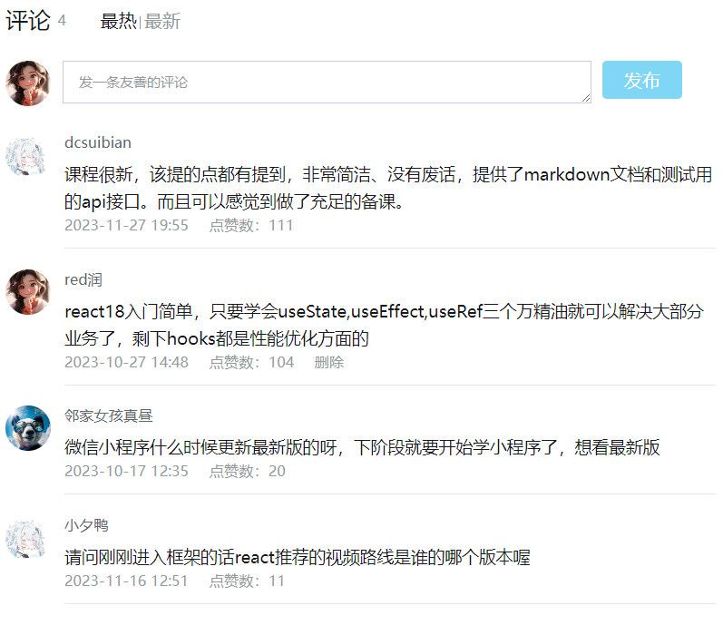

## React进阶

### 1. 创建项目

安装脚手架：`npm i -g create-react-app`

使用脚手架创建react工程：`create-react-app hello-react`

### 2. 基础样式

1. 行内样式（不推荐）

    ```html
    <div style={{ color: 'red' }}>展示一下对象</div>
    ```

2. class类名控制

    ```html
    <div className="foo">展示一下对象</div>
    ```

3. `classnames`: 用于有条件地将 classNames 连接在一起

    [https://github.com/JedWatson/classnames](https://github.com/JedWatson/classnames)

4. 为避免样式冲突，可以实现样式模块化

    - 将css文件名修改： `index.css` ---> `index.module.css`
    - 引入并使用的时候改变方式
        ```js
        import React,{ Component } from 'react'
        import hello from './index.module.css'  //引入的时候给一个名称

        export default class Hello extends Component{
            render() {
                return (
                    <h1 className={hello.title}>Hello</h1>   //通过大括号进行调用
                )
            }
        }
        ```
    - 相较于标准的外部样式表来说，`CSS Module`就是多了一点——确保类名的唯一，通过内部算法避免了两个组件中出现重复的类名，如果你能保证不会出现重复的类名，其实直接使用外部样式表也是一样的

### 3. 评论（案例）

1. 启动服务器

    ```shell
    # 切换到server目录下
    cd ./server

    # 启动服务器，端口5005
    nodemon ./reactServer/server.js
    ```

2. 评论

    

### 4. hooks

#### 1. useState

```javascript
import  { useState } from 'react';

const [count, setCount] = useState(100);

const handleClick = (e, param) => {
    setCount(count + 1);
}
```

1. `useState`是一个函数，返回值是一个数组

2. 数组中的第一个参数是状态变量，第二个参数是set函数用来修改状态变量

3. `useState`的参数将作为变量的初始值

#### 2. useRef

在react组件中获取/操作dom, 需要使用useRef钩子函数

```javascript
import  { useRef } from 'react';

const inputRef = useRef(null);

<input type="text" ref={inputRef} />

console.log(inputRef.current)
```

1. 使用`useRef`创建一个ref引用，并与jsx绑定

2. 在dom可用时，通过`inputRef.current`获取dom元素

#### 3. useContext

读取和订阅组件中的 context, 参考[跨层组件通信-context](#3-usecontext)

#### 4. useEffect

在组件中创建不是由事件引起而是`由渲染本身引起`的操作，比如发送ajax请求，更改dom等

```javascript
// 参数一： 副作用函数， 在函数内部可以放置要执行的操作
// 参数二： 依赖项数组，当依赖项数组中的值发生变化时，会重新执行副作用函数（当数组是空数组时，副作用函数只会在组件渲染完毕后执行一次）

async function getList() {
    const result = await (await fetch('commentList.json')).json();
    setCommentList(result.sort((a, b) => b.fave - a.fave))
}

useEffect(() => {
    getList();
}, [])
```

`useEffect`副作用函数执行时机存在多种情况，根据传入依赖项的不同，会有不同的执行表现


`useEffect`清除副作用：比如在`useEffect`中开启一个定时器，想在组件卸载时清除，这个过程就是清理副作用

```javascript
useEffect(() => {
    // 实现副作用操作逻辑
    return () => {
        // 清理副作用操作逻辑
    }
}, [])

// 定义一个定时器
useEffect(() => {
    const timer = setInterval(() => {
        console.log('定时器')
    }, 1000)

    return () => {
        // 组件卸载时
        clearInterval(timer);
    }
}, [])
```

#### 5. 自定义hook函数（useToogle）

自定义hook是以`use打头的函数`，通过自定义hook函数可以用来实现`逻辑的封装和复用`

```javascript
// 问题： 布尔切换逻辑，当前组件耦合在一起的，不方便复用

import  { useState } from 'react';

// 1. 声明一个use打头的函数
function useToogle() {
    // 2. 在函数体内封装可复用逻辑
    const [value, setValue] = useState(true);
    const toggle = () => setValue(!value);

    // 3. 把组件中用到的状态或回调return出去
    return {
        value,
        toggle
    }
}

export default function CustomHook() {
    // 4. 在哪个组件中要用到这个逻辑，就去执行这个函数，结构出来状态和回调进行使用
    const { value, toggle } = useToogle();

    return (
        <div>
            {value && <div>this is div</div>}
            <button onClick={toggle}>toggle</button>
        </div>
    );
}
```

### 5. 组件通信

组件通信通信就是组件之间的数据传递，根据组件嵌套关系的不同，有不同的通信方法

#### 1. 父子通信-父传子

1. props可传递任意的数据

2. props是只读的，不能进行修改

3. 数据传递案例

    1. 父组件传递数据 - 在子组件标签上绑定属性

        ```javascript
        <ChildComponent name="basic" />


        // 当我们把内容嵌套在子组件标签中时，父组件会自动在名为children的prop属性中接受该内容（即props中会加一个children属性）
        <ChildComponent>
            <span>this is span</span>
        </ChildComponent>
        ```
        
    2. 子组件接收数据 - 通过`props`接收父组件传递的数据

        ```javascript
        const ChildComponent = (props) => {
            return (
                <div>
                    {props.name}
                    {props.children}
                </div>
            )
        }
        ```

#### 2. 父子通信-子传父

在子组件中调用父组件中的函数并传递参数

数据传递案例

1. 父组件传递数据 - 在子组件标签上绑定方法

    ```javascript
    <Son onGetMsg={getMsg} />
    ```
    
2. 子组件接收数据 - 通过`props`接收父组件传递的方法并调用

    ```javascript
    function Son({ onGetMsg }) {
        const sonMsg = 'this is son msg';
        return <div>
            我是子组件
            <div>
                <button onClick={() => onGetMsg(sonMsg)}>发送信息到父组件</button>
            </div>
        </div>
    }
    ```

#### 3. 兄弟通信-状态提升

借助”状态提升“，通过父组件进行兄弟组件之间的数据传递

数据传递案例

1. 父组件传递数据 - 在A组件标签上绑定方法，并将在A组件中获取到的数据保存下来

    ```javascript

    const [name, setName] = useState('')
    
    const getMsg = (msg) => {
        setName(msg);
    }

    // 获取A组件中的数据
    <A onGetMsg={getMsg} />

    // 将从A组件中获取的数据传到B组件
    <B name={name}/>
    ```
    
2. 子组件接收数据 - 通过`props`接收父组件传递的方法并调用

    ```javascript
    function A({ onGetMsg }) {
        const sonMsg = 'this is A name';
        return <div>
            我是A组件
            <div>
                <button onClick={() => onGetMsg(sonMsg)}>发送信息到父组件</button>
            </div>
        </div>
    }
    ```
3. 子组件接收数据 - 通过`props`接收父组件传递的数据

    ```javascript
    function B({ name }) {
        return <div>
            我是B组件 --- {name}
        </div>
    }
    ```

#### 4. 跨层组件通信-Context

1. `createContext`方法创建一个上下文对象

    ```javascript
    const MsgContext = createContext();
    ```

2. 在顶层组件中，通过`Provider`组件提供数据

    ```javascript
    // 在顶层组件中使用 App -> B -> C
    <MsgContext.Provider value={msg}>
        <C />
    </MsgContext.Provider>
    ```

3. 在底层组件，通过`useContext`钩子函数使用数据
    
    ```javascript
    function C() {
        const msg = useContext(MsgContext);
        return <div>
            我是C组件  -- {msg}
            <B />
        </div>
    }
    ```

1. 只能在组件中或其他自定义hook中使用

2. 只能在组件的顶层调用，不能嵌套在if，for，其他函数中