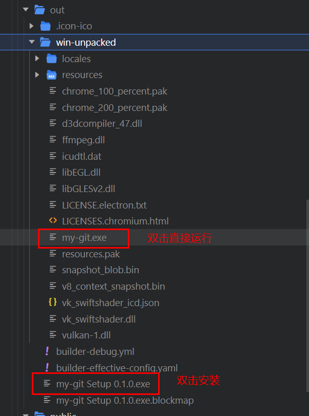

## my-git

### 1. 初始化项目

参考文档[React+Electron搭建桌面应用](https://blog.csdn.net/weixin_44461275/article/details/124411281)

### 2. 出包

参考文档[Electron + React 应用打包全流程](https://blog.csdn.net/raspi_fans/article/details/128683234)

#### 遇到的问题

出包时报错，需要关闭防火墙或者将项目添加到防火墙白名单

### 3. 运行或打包



1. 运行

```shell
npm run start
npm run electron:dev
```

2. 打包

```shell
npm run build
npm run package
```