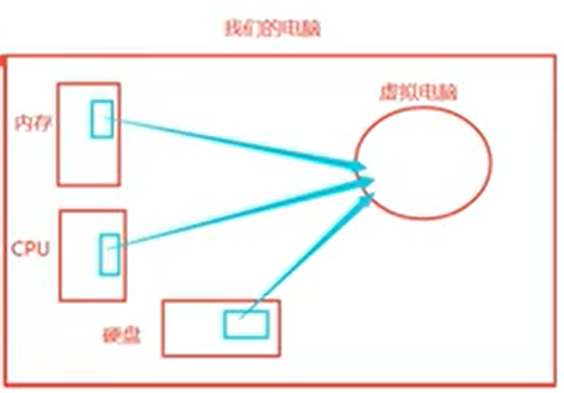

# 真机和虚拟机

## 1. 真机和虚拟机概念说明

创建虚拟机就是通过技术手段，在我们自己的物理机（真机）上虚拟出来几个电脑，并安装上想要的操作系统。关于虚拟电脑的说明，

虚拟电脑是从自己的电脑上分配出来一部分资源给它，也组成一个电脑，只要给这个虚拟机安装操作系统，那就可以和正常的电脑一样来使用

## 2. 真机光盘安装和vmware虚拟化工具的安装

## 3. windows上面创建虚拟机